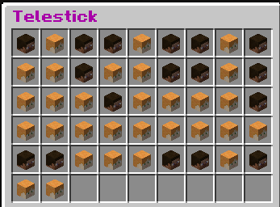
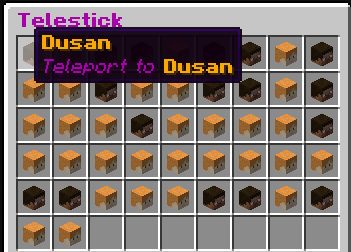

# telestick
teleport-menu plugin with wich you can teleport to any player (if you have the permissions, of course).  




# features
* multi-language support (currently pl and en), the language is automatically detected for each client.  
* player heads with skins in the gui.  
* the gui size is scaled according to the player count.

# commands
* ```ts``` - open the Telestick menu  
* ```ts-version``` - shows the current Telestick version  

# to do
* multi-page gui when playerCount > 54  

# permissions
* ```telestick``` - permission to use the ```ts``` command
* ```telestick-version``` - permission to use the ```ts-version```